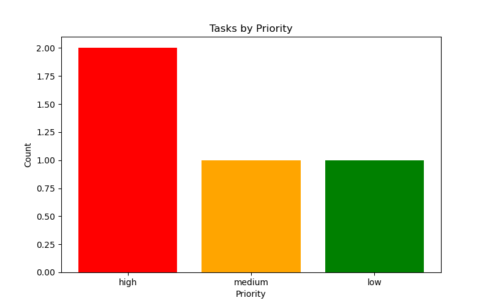
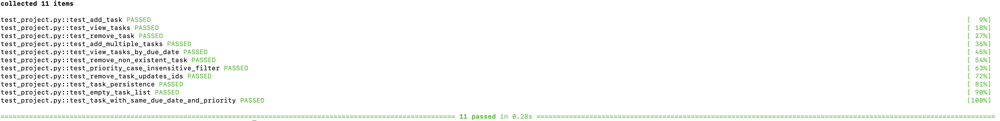

# Todo List Manager Project

This project is a simple task management tool that allows users to add, view, and remove tasks. It includes features for task visualization by priority and provides testing using `pytest`.

## Table of Contents

1. [Setup](#setup)
2. [Usage](#usage)
3. [Running the Tests](#running-the-tests)
4. [Visualizing Tasks](#visualizing-tasks)
5. [Images and Screenshots](#images-and-screenshots)

---

## Setup

To set up and run this project, follow these steps:

1. **Clone the Repository**

   ```bash
   git clone https://github.com/AICodingGenius/project-todolist-python.git
   cd todo-list-manager
   ```

2. **Install Dependencies**

   Make sure you have `Python 3` and `pip` installed. You can install the required packages using the `requirements.txt` file:

   ```bash
   pip install -r requirements.txt
   ```

3. **Check Project Structure**

   The project directory should have the following structure:

   ```
   todo-list-manager/
   ├── project.py           # Main source code for the task manager
   ├── test_project.py      # Test file using pytest
   ├── requirements.txt     # List of dependencies
   ├── mytasks.json         # JSON file storing tasks
   └── README.md            # This file
   ```

---

## Usage

### Adding Tasks
You can add tasks to the task manager using the following command:

```python
from project import add_task

add_task("Task description", "2024-12-31", "high")
```

### Viewing Tasks
To view all tasks or filter tasks based on priority or due date:

```python
from project import view_tasks

# View all tasks
tasks = view_tasks()

# View tasks filtered by priority
high_priority_tasks = view_tasks(filter={'priority': 'high'})

# View tasks filtered by due date
tasks_due = view_tasks(filter={'due_date': '2024-12-31'})
```

### Removing Tasks
To remove a task by its ID:

```python
from project import remove_task

remove_task(1)  # Replace with the task ID you want to remove
```

---

## Running the Tests

This project uses `pytest` for testing. All tests are contained in the `test_project.py` file.

1. **Run All Tests**

   To run all tests, execute:

   ```bash
   pytest -v
   ```

2. **Run Specific Test**

   To run a specific test, use:

   ```bash
   pytest -v test_project.py::test_function_name
   ```

   For example:

   ```bash
   pytest -v test_project.py::test_add_task
   ```

3. **View Output Without Capturing**

   To see print statements and other output during testing, use:

   ```bash
   pytest -v --capture=no
   ```

---

## Visualizing Tasks

The project includes a function to visualize tasks based on priority. To visualize tasks:

```python
from project import visualize_tasks_by_priority

visualize_tasks_by_priority()
```

This will generate a bar chart showing the count of tasks for each priority (e.g., high, medium, low).

---

## Images and Screenshots

Below are some images and screenshots to illustrate the different functionalities:

### Task Visualization


### Running Tests



---

## License

This project is licensed under the MIT License - see the [LICENSE](LICENSE) file for details.
